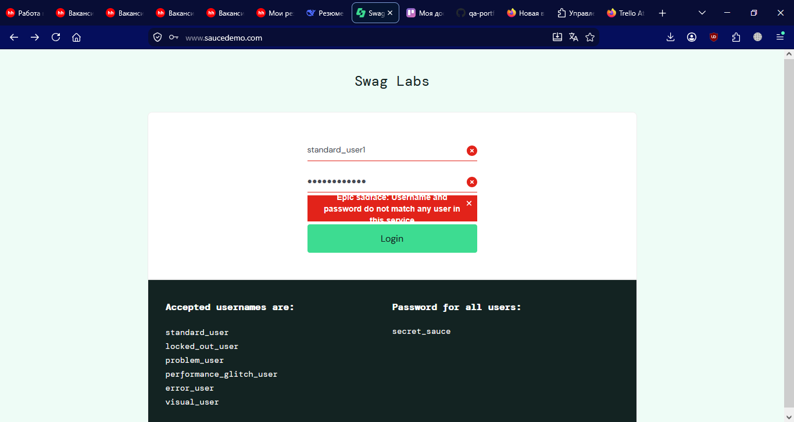
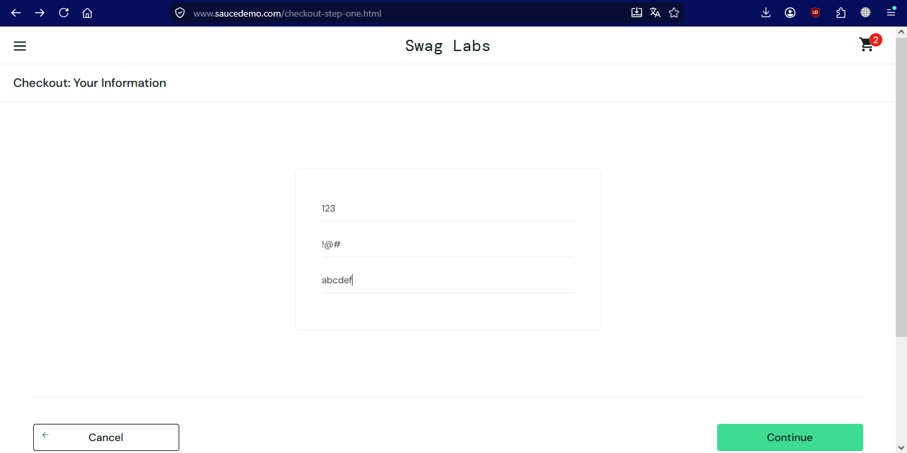
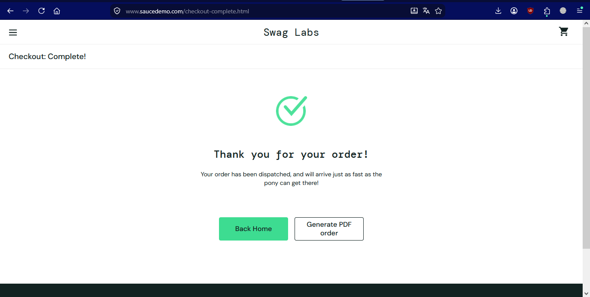
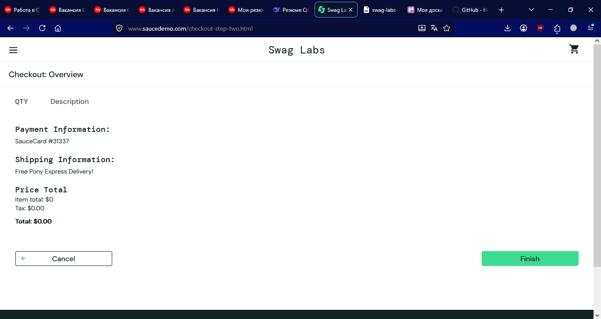
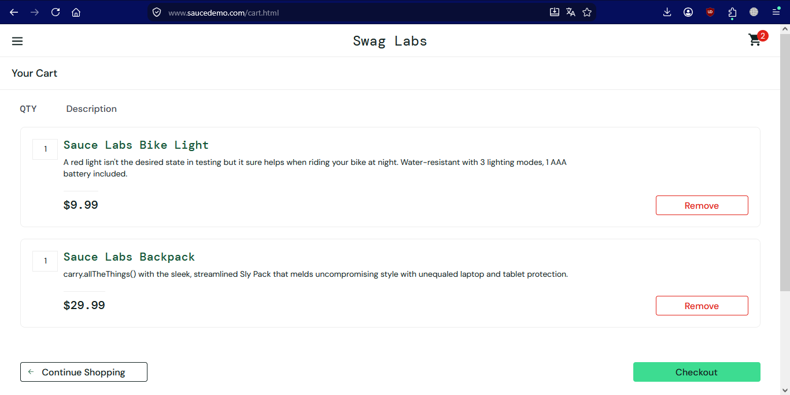

# Баг-репорты SauceDemo

**Сайт:** https://www.saucedemo.com/
**Окружение:** Firefox 155.0.1, Windows 10
**Аккаунт:** standard_user

---

## Баг 1: При неверном логине или пароле выводится общее сообщение об ошибке

**Severity:** Minor
**Priority:** Low

**Предусловие:**
Открыта страница логина https://www.saucedemo.com/

**Шаги воспроизведения:**
1. Ввести верный логин «standard_user»
2. Ввести неверный пароль «wrong_password»
3. Нажать «Login»
4. Записать текст сообщения об ошибке
5. Повторить с неверным логином и верным паролем
6. Сравнить сообщения

**Ожидаемый результат:**
Сообщение об ошибке указывает, какое именно поле заполнено неверно: «Неверный пароль» или «Пользователь не найден».

**Фактический результат:**
В обоих случаях выводится одно и то же общее сообщение: «Username and password do not match any user in this service». Пользователь не понимает, что именно он ввел неправильно.

**Вложения:**
*Скриншот 1 — неверный пароль:*

*Скриншот 2 — неверный логин:*

---

## Баг 2: Форма Checkout принимает буквы в поле Postal Code и цифры в имени

**Severity:** Major
**Priority:** Medium

**Предусловие:**
Пользователь авторизован, товар добавлен в корзину

**Шаги воспроизведения:**
1. Открыть https://www.saucedemo.com/inventory.html
2. Добавить любой товар в корзину
3. Перейти в корзину → нажать «Checkout»
4. В поле «First Name» ввести «123»
5. В поле «Last Name» ввести «!!!»
6. В поле «Zip/Postal Code» ввести «abcde»
7. Нажать «Continue»

**Ожидаемый результат:**
Форма отклоняет ввод: «First Name» и «Last Name» принимают только буквы, «Postal Code» — только цифры. Появляется сообщение об ошибке валидации.

**Фактический результат:**
Форма принимает любые символы без проверки и пропускает пользователя на страницу обзора заказа (Checkout: Overview).

**Вложения:**
*Скриншот 1 — введены некорректные данные:*

*Скриншот 2 — переход на страницу Overview:*

---

## Баг 3: Оформление заказа доступно при пустой корзине

**Severity:** Major
**Priority:** High

**Предусловие:**
Пользователь авторизован, корзина пуста

**Шаги воспроизведения:**
1. Открыть https://www.saucedemo.com/inventory.html
2. Убедиться, что корзина пуста
3. Перейти в корзину
4. Нажать «Checkout»
5. Заполнить форму (First Name, Last Name, Postal Code)
6. Нажать «Continue» → «Finish»

**Ожидаемый результат:**
Система не позволяет оформить заказ с пустой корзиной. Кнопка «Checkout» заблокирована, или появляется сообщение «Корзина пуста».

**Фактический результат:**
Система позволяет пройти весь процесс оформления заказа с пустой корзиной. Пользователь получает подтверждение заказа без единого товара.

**Вложения:**
*Скриншот 1 — пустая корзина с активной кнопкой Checkout:*

*Скриншот 2 — подтверждение заказа без товаров:*

---

## Баг 4: Отсутствует возможность изменения количества товара в корзине

**Severity:** Major
**Priority:** High

**Предусловие:**
Пользователь авторизован, товар добавлен в корзину

**Шаги воспроизведения:**
1. Открыть https://www.saucedemo.com/inventory.html
2. Добавить любой товар в корзину
3. Перейти в корзину
4. Попытаться изменить количество товара (найти поле ввода, кнопки «+» / «-»)

**Ожидаемый результат:**
В корзине можно изменить количество единиц товара: увеличить или уменьшить без удаления позиции.

**Фактический результат:**
Функция изменения количества отсутствует. Доступно только полное удаление товара кнопкой «Remove».

**Вложения:**
*Скриншот 1 — корзина с товаром, нет кнопок изменения количества:*

